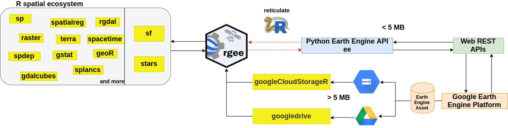

## 데이터 표준

### 저장 포맷

### 압축 포맷

### 공통 포맷

### 수준

### 메타 데이터

## 데이터 공급

### 웹사이트

-   EarthExplore

    -   [USGS](https://www.usgs.gov/)

    -   <https://earthexplorer.usgs.gov/>

    -   Landsat, AVHRR, SRTM, NLCD, GLCC, RADAR

-   EarthData

    -   [NASA](https://www.nasa.gov/)

    -   <https://www.earthdata.nasa.gov/>

-   The Copernicus Data Space Ecosystem

    -   [ESA](https://dataspace.copernicus.eu/)

    -   <https://browser.dataspace.copernicus.eu/>

-   3DEP LidarExplorer

    -   [USGS](https://www.usgs.gov/)

    -   <https://apps.nationalmap.gov/lidar-explorer/>

### 구글 어스 엔진(Google Earth Engine)

-   <https://earthengine.google.com/>

## 데이터 구득

### 구글 어스 엔진

-   QGIS Plug in for Earth Engine

    -   <https://gee-community.github.io/qgis-earthengine-plugin/>

-   `rgee`: Google Earth Engine for R

    -   <https://r-spatial.github.io/rgee/#quick-start-users-guide-for-rgee>

### R 패키지

-   `CDSE`: Copernicus Data Space Ecosystem API Wrapper

    -   <https://zivankaraman.github.io/CDSE/>

    -   Sentinel

-   `getSpatialData`

    -   <https://github.com/16EAGLE/getSpatialData>

    -   Landsat, Sentinel, MODIS, SRTM

-   `openeo`: Client Interface for openEO Servers

    -   <https://github.com/Open-EO/openeo-r-client>

-   `rsi`: spectral indices

    -   <https://permian-global-research.github.io/rsi/>

-   `rstac`: R client library for STAC

    -   SpatioTemporal Asset Catalog (STAC)

    -   <https://brazil-data-cube.github.io/rstac/reference/rstac.html>
